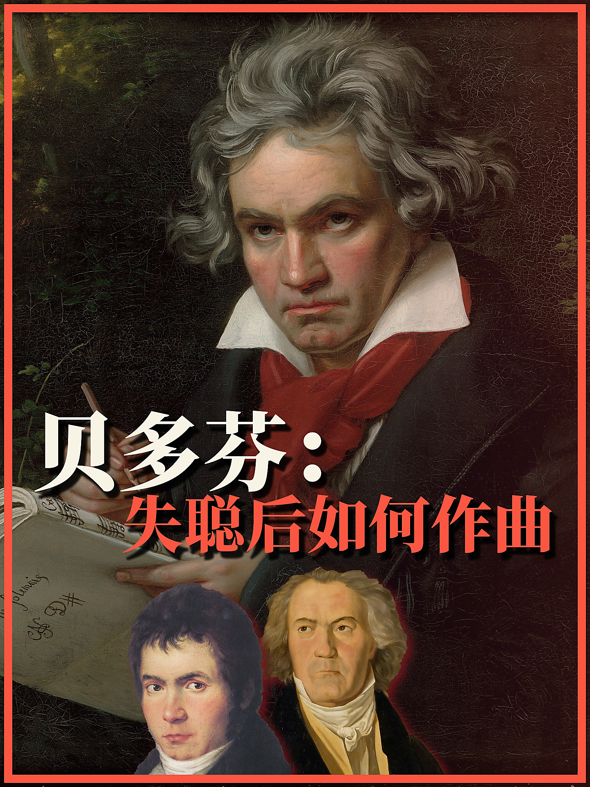
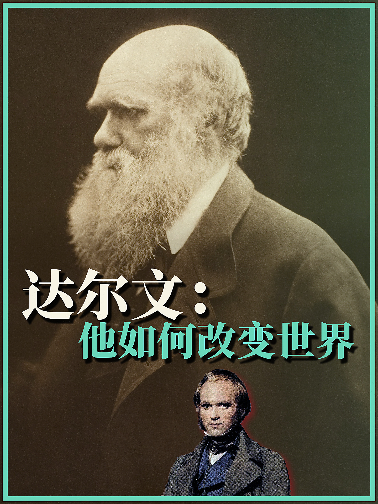
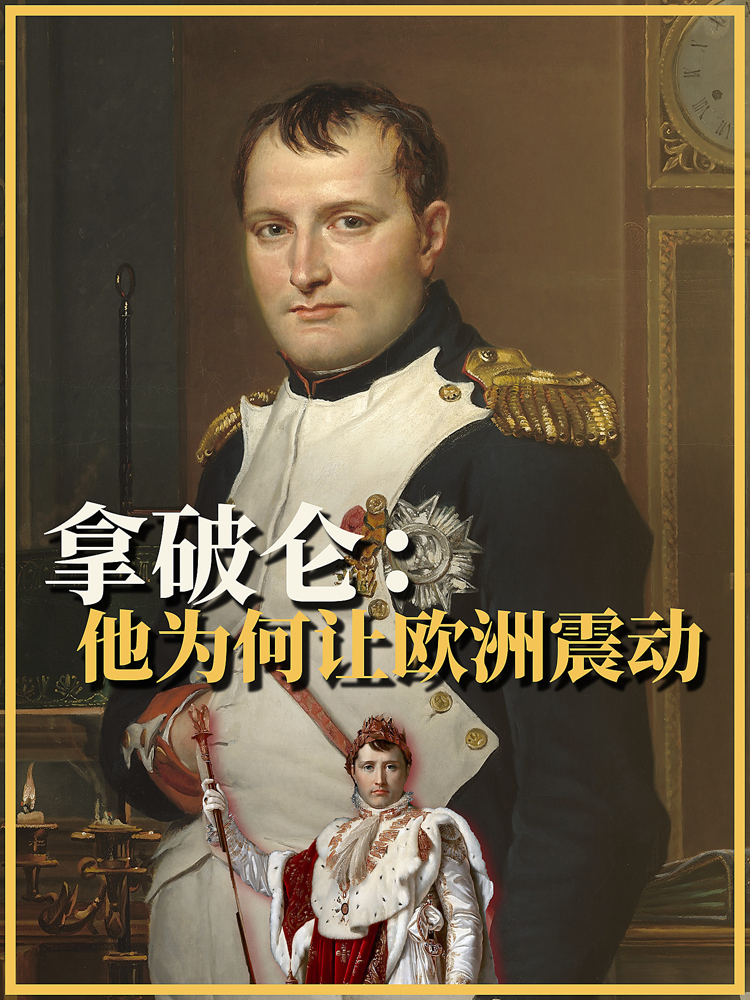
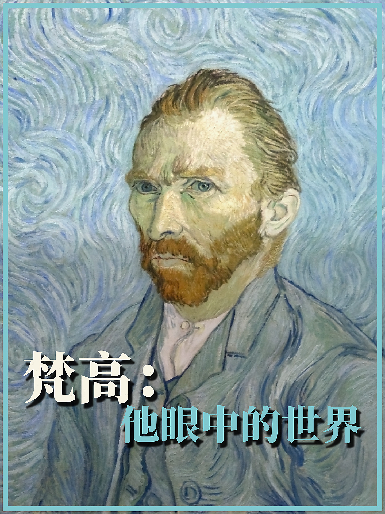

# Retro Topic Cover · 复古主题封面

用真实照片、历史绘画和人物抠图制作中文复古封面。**不使用 AI 生图**：Pillow 排版、传统 GrabCut 抠图，保留原始素材。



- 默认 3:4（1440×1920），两行横排标题集中呈现，位置可调。
- 完整背景 + 2–3 张独立素材的透明人物拼贴。
- 前景交叠、高低错落、暗红柔影，人物与阴影裁切在边框内。
- 附完整示例、字体及素材许可；无需 API Key。

## 更多示例

| 达尔文 · 青绿色拼贴 | 莎士比亚 · 金色拼贴 |
| --- | --- |
|  |  |
| [素材来源](examples/darwin/SOURCES.md) | [素材来源](examples/shakespeare/SOURCES.md) |

| 拿破仑 · 加冕人物拼贴 | 梵高 · 纯主图排版 |
| --- | --- |
|  |  |
| [素材来源](examples/napoleon/SOURCES.md) | [素材来源](examples/vangogh/SOURCES.md) |

五个示例均附背景、所用透明前景、排版参数与许可说明。安装依赖后可一键重新渲染：

```bash
python scripts/render_examples.py
# 或仅渲染指定示例
python scripts/render_examples.py darwin napoleon
```

`recipe.json` 控制标题、颜色和标题位置；`layout.json` 控制前景拼贴。

## 安装为 Codex Skill

需要 Python 3.10+、Git。在尚未安装同名技能时执行：

```bash
git clone https://github.com/chengyi-ai/retro-topic-cover.git ~/.codex/skills/retro-topic-cover
cd ~/.codex/skills/retro-topic-cover
python3 -m venv .venv
source .venv/bin/activate
pip install -r requirements.txt
```

已有同名目录时先备份，勿直接覆盖自定义内容。重启 Codex 后输入：

```text
使用 $retro-topic-cover 做一张人物主题封面，配两个不同素材的抠图，不用 AI 生图。
```

## 直接运行

在仓库根目录、上述虚拟环境中执行：

```bash
python scripts/render_cover.py \
  --main examples/beethoven/background.jpg \
  --line1 '贝多芬：' --line2 '失聪后如何作曲' \
  --title-y .49 --accent '#fa5642' \
  --collage examples/beethoven/layout.json \
  --output out/beethoven.jpg
```

不传 `--collage` 即只排背景与标题。`--title-y` 为第一行文本锚点的画布高度比例；字形实际顶部受字体度量影响。`--focus-x`、`--focus-y` 控制背景裁切焦点。

拼贴 JSON 见 [示例](examples/beethoven/layout.json)。`cutouts` 按后到前排序，`path` 相对 JSON 文件，`width`、`x`、`y` 是画布比例；可以添加第三个人物。每个人物必须是透明 PNG，且来源不同于背景。位置需结合具体人脸和标题手动检查。

## 传统抠图（可选）

```bash
pip install -r requirements-cutout.txt
python scripts/extract_cutout.py --input portrait.jpg \
  --polygon polygon.json --output out/person.png
```

`polygon.json` 为原图像素坐标数组，如 `[[120,30],[330,50],[390,580],[80,580]]`。沿人物轮廓标点，再由 GrabCut 细化边缘；`--band` 控制轮廓附近待细化范围。此工具需要人工提供轮廓，不是自动识别人像；复杂头发、相近背景色可能需要重新标点。源图和最终透明边缘都应目视检查。

## 许可

代码与技能说明采用 [MIT](LICENSE)。字体 Noto Serif SC Black 采用 [SIL OFL](assets/OFL.txt)。示例使用公有领域绘画，来源与许可见 [SOURCES.md](examples/beethoven/SOURCES.md) 及各示例目录的 SOURCES.md。第三方素材不因本仓库的代码许可而改变原有权利；请自行核验新增素材的使用权限。
